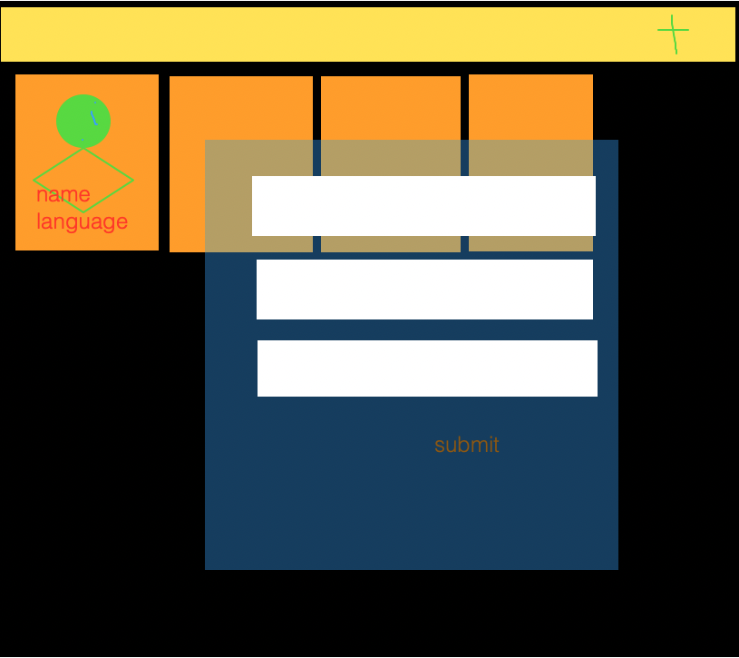

## Coders App

Esta aplicación permite gestionar un listado de coders, 
que se almacenan en una base de datos.

## API REST 

| Method | PATH           | Description |
|--------|----------------|-------------|
| GET    | `/coders`      | |
| GET    | `/coders/{id}` | |
| POST   | `/coders`      | |
| PUT    | `/coders`      | |
| DELETE | `/coders/{id}` | |

